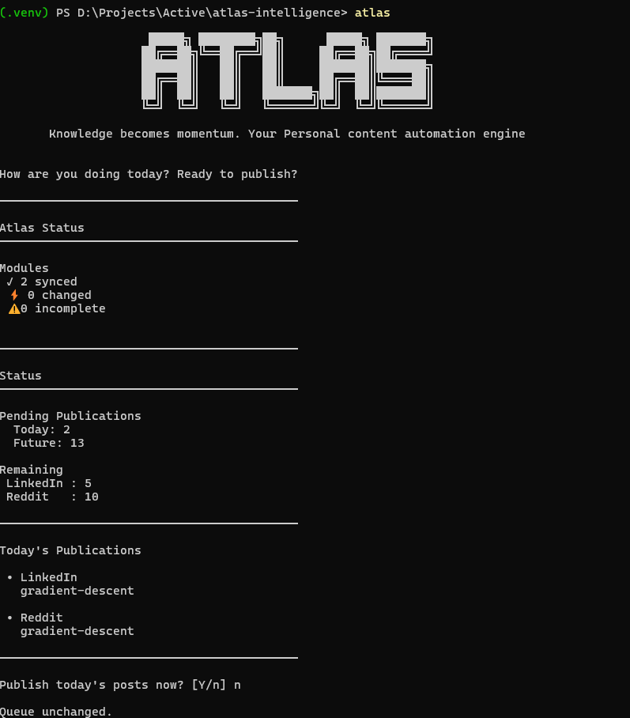
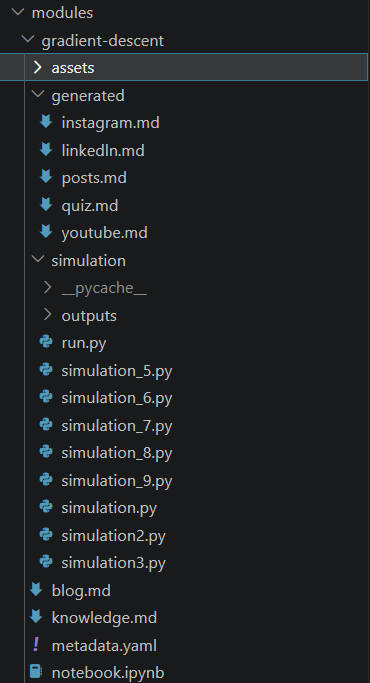
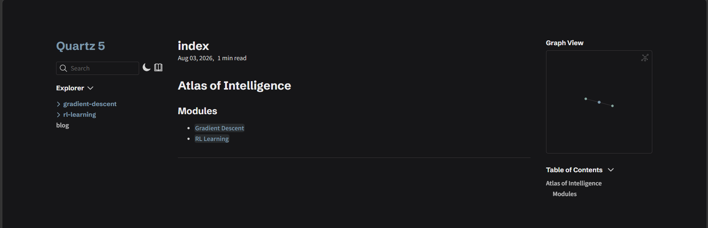
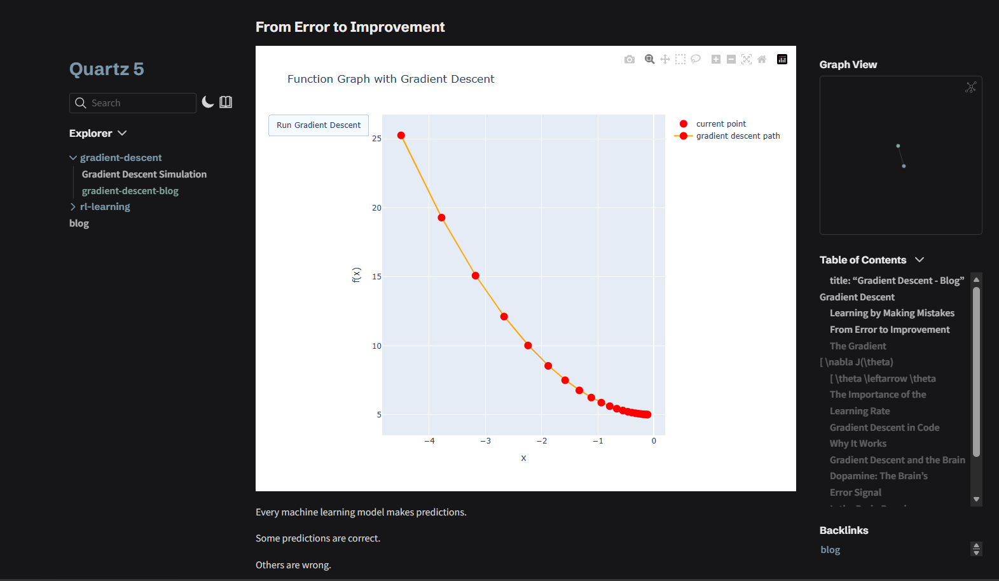
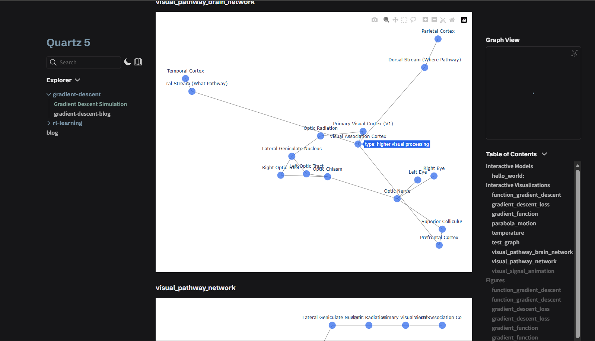
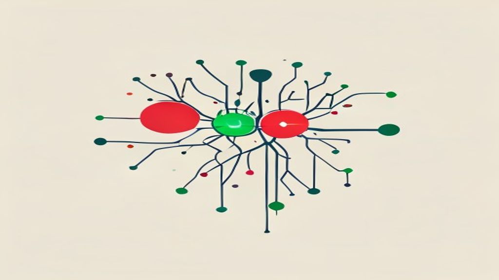

# Atlas:A personal knowledge system for turning learning into structured content and automating publishing pipelines.

CLI:



# Why Atlas?

Modern learning produces fragmented information:

- Notes are disconnected
- Research is difficult to organize
- Simulations and visualizations are separate from explanations
- Publishing knowledge requires repeated manual work

Atlas creates a pipeline where learning becomes structured, visual, and shareable.
Atlas is a framework for organizing knowledge, simulating (read CONTRACTmd to learn what a simulation is) visuals and publishing said knowledge.

It transforms:

```
                    Idea / Question
                           ↓
                    Knowledge Module (all user puts effort into)
                           ↓
                    AI powered automation Pipeline
                           ↓
              ┌────────────┴────────────┐
              ↓                         ↓
       Narrative Content          Simulation
              ↓                         ↓
       Blog + Social Posts       Interactive Assets
              └────────────┬────────────┘
                           ↓
                    Atlas Website
                           ↓
                 Automated Distribution
```

---

# What is Atlas?

Most knowledge systems focus on storing information.

Atlas focuses on building understanding and coherant narratives.

Instead of disconnected notes, Atlas creates structured knowledge modules that combine:

- Explanations
- Research
- Simulations
- Visualizations
- Published documentation
- Engaging social media content

Each module becomes a self-contained piece of knowledge.

---

# Features

## Knowledge Modules

Atlas organizes knowledge into independent modules.

A module can represent:

- Scientific concepts
- Engineering topics
- Algorithms
- Biological systems
- Mathematical ideas
- Personal research

Example:

```
module-name/

├── knowledge.md
│
├── blog.md
│
├── notebook.ipynb (optional for ppl who like coding)
│
├── simulation/
│
├── assets/
│
└── metadata
```

---

## AI Research-Simulation Pipeline

Atlas includes an AI-assisted simulation workflow that help turn an idea eg: 'a graph of all visual information processing parts of the brain' into an interactive visual you can incorporate in your website.

**Supported outputs:**
- Figures
- Graphs
- Animations
- Datasets
- Interactive models

The pipeline:

```
Scientific/ Research Idea
    ↓
Research Agent (atlas make research)
    ↓
Structured Simulation guide (atlas make simulation)
    ↓
Coressponding interactive visual generated
```

Simulations are Atlas-managed experiments.
They follow the Atlas simulation contract and are executed through the Atlas runtime:
This allows Atlas to manage rendering, previews, and exports consistently.

Do not run simulations as regular python files.
Use terminal command `atlas run module_name simulation_name` instead

---

## Website Generation

Atlas converts knowledge modules into a browsable website.

Workflow:

```
Module (atlas create)
   ↓
Build
   ↓
Published Knowledge Atlas
```

Generated websites contain:

- Knowledge pages
- Navigation
- Index pages
- Visualizations
- Interactive content

---


## Content Generation

Atlas converts knowledge into posts, social media content, assets like images and quizzes.

Workflow:

```
Module (atlas create)
   ↓
Generate Artifacts (raw coontent)
   ↓
Published Knowledge Atlas with content links creating a network of your socials
```

Generated content contains:

- LinkedIn Posts
- Reddit/ Social Media posts
- Youtube video outline
- Instagram video script
- Quiz
- Images (for assets or social media content)
- Interactive content


# Installation

Clone the repository:

```bash
git clone YOUR_REPOSITORY_URL

cd atlas
```

Create a virtual environment:

```bash
python -m venv .venv
```

Activate it:

Windows:

```bash
.venv\Scripts\activate
```

Linux/macOS:

```bash
source .venv/bin/activate
```

Install dependencies:

```bash
pip install -r requirements.txt
```

---

# Quick Start

Create a module:

```bash
atlas create "write module_name here"
```

Generate research/simulation:

```bash
atlas make research
```
```bash
atlas make simulation module_name
```

Generate content/posts:

```bash
atlas generate module_name
```

Build the website and start content publishing pipeline:

```bash
atlas publish module_name
```

---

# Summary

```
Atlas

├── Module System
│
├── Research-Simulation Pipeline
│
├── Content Generation Pipeline
│
├── Website Builder
│
└── Publishing System
```

## Module System

The core unit of knowledge.

Modules contain the information, experiments, and resources related to a topic.

## Research-Simulation Engine

A framework for creating computational models and visual explanations.

## Website Builder

Transforms knowledge modules into a navigable website.

## Publishing System

Publishes content to help your content gain traction.

---

# Philosophy

Atlas follows one principle:

> Knowledge should be explored, not managed.

The workflow:

```
Curiosity
    ↓
Understanding
    ↓
Explanation
    ↓
Creation of 1 module
```

The goal is not collecting notes.

The goal is building a personal intelligence system that turns your knowledge into a structured Atlas of Information. Automating publishing, setting reminders, checking modules for issues and streamlining notes.

---

# Example Project

Completed Module Structure:



Website Index:



Blog page with Simulations (embedding knowledge needed):



Simulation Page:




Generated posts:
[posts.md](modules/gradient-descent/generated/posts.md)

Generated Quiz:
[quiz.md](modules/gradient-descent/generated/quiz.md)

Generated images:


Generated Instagram:
[instagram.md](modules/gradient-descent/generated/instagram.md)

A demonstration of Atlas converting a research topic into:

- Structured knowledge
- Interactive simulations
- Website content
- Social media artifacts

---

# Status

Atlas is currently in active development.

Version: v1.0

The core pipeline is functional:
- Knowledge modules
- AI research generation
- Simulation framework
- Website generation
- Content generation
- Publishing automation

## Future

- Improved knowledge graphs
- Better semantic search
- Automated knowledge connections
- Automated simulation making for complicated models

---

# License

MIT License

---

# Contact

parshatwork@gmail.com